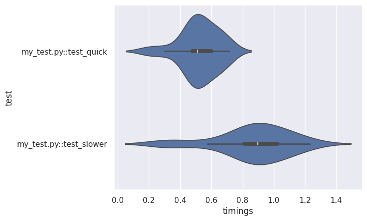
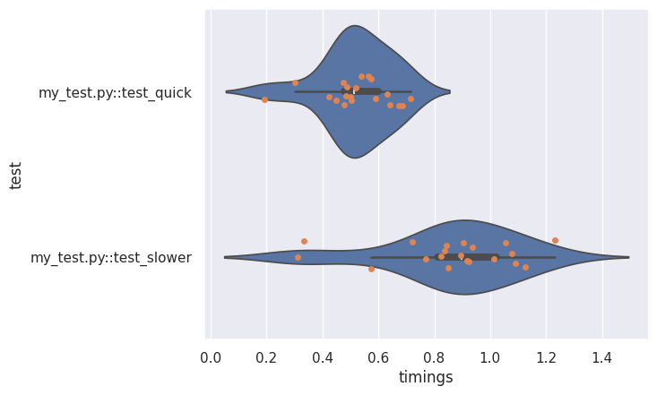

# perf-test

This repo provides a performance testing framework based on `pytest`.

## Quick start

The dependencies and runtime are managed in a `pipenv` environmment file.
To get started, make sure [`pipenv` is installed](https://pipenv.pypa.io/en/latest/installation.html).
You should then be able to run `pipenv sync` to get the environment up to date with the lock file.
To open a shell, run `pipenv shell`.

To execute the tests defined in this repository, run the command `pytest`.

## Writing tests

**pytest** tests are discovered based on name.

- Tests must be defined in files of the form `test_*.py` or `*_test.py`.
- Any functions or methods that start with the string `test` will be run as a test.
- Tests can be grouped together in classes for convenience.
  The class names must start with `Test`.
  NB These classes should not have an `__init__` constructor.

Refer to [pytest Getting Started guide](https://docs.pytest.org/en/7.4.x/getting-started.html) for basic info.

Tests look like this:

```py
# content of test_sample.py
def func(x):
    return x + 1

def test_answer():
    assert func(3) == 5
```

In this example, `func` is being tested by `test_answer`.
This test will, of course, fail.

```bash
$ pytest
=========================== test session starts ============================
platform linux -- Python 3.x.y, pytest-7.x.y, pluggy-1.x.y
rootdir: /home/sweet/project
collected 1 item

test_sample.py F                                                     [100%]

================================= FAILURES =================================
_______________________________ test_answer ________________________________

    def test_answer():
>       assert func(3) == 5
E       assert 4 == 5
E        +  where 4 = func(3)

test_sample.py:6: AssertionError
========================= short test summary info ==========================
FAILED test_sample.py::test_answer - assert 4 == 5
============================ 1 failed in 0.12s =============================
```

This shows that one test was run from `test_sample.py`, and that test failed.

## Performance testing

This repo is mainly not interested in the results of the tests, but instead in the time taken to execute certain actions.
**pytest** provides a number of ways extend the default behaviour in the form of fixtures and hooks.

### Record and report timings

`conftest.py`, which is a file containing pytest customisation, defines the `record_timings` fixture which will enable an action to be run a number of times and for the time taken for each run to be recorded and summarised.

The fixture is a function which expects to receive a function to execute as a parameter.
It then runs this repeatedly, collecting timing for each run.
These timings are appended to a list.

```py
# test_perf.py
def test_example(record_timings):

    def function_to_test():
        ...body of function to test...

    # Run the function repeatedly
    record_timings(function_to_test)
```

A arguments can be passed to the function under test by providing a nested list of arguments. The code will loop around the top level list, providing these as arguments to the function.

```py
# test_perf.py
def test_example(record_timings):
    def f(arg1, arg2):
        ...body of function to test...

    # Run the function repeatedly first as f(1, 2), then as f(3, 4).
    # This will cycle round if the argument list is exhausted.
    record_timings(f, test_function_args=[
      [1, 2],
      [3, 4]
    ])
```

By default, this will run 20 times, with the function being called once per repeat.
It's possible to change these if needed, which is useful if the test case completes very fast.

```py
# test_perf.py
def test_example(record_timings):

    def f():
        ...body of function to test...

    # Run the function 100 times per repeat, and for 100 repeats
    record_timings(f, number=100, repeat=100)
```

Finally, if you want to access the results of the tests, the `record_timings` fixture
returns an object containing all the results of the execution.

```py
# test_perf.py
def test_example(record_timings):

    def f():
        ...body of function to test...

    # Run the function 100 times per repeat, and for 100 repeats
    results = record_timings(f, number=100, repeat=100)

    # There should be 100 results (each being a timing for 100 executions of `f`)
    assert len(results) == 100
    # Test the outcome - this might be useful to check that no errors occurred
    assert results[0] == ...expected value...
```

The summary occurs at the end of the test run, triggered by the `pytest_sessionfinish` hook.
The fixture captures a result set per executed test which uses the `record_timings` fixture,
and the summary saves this to a timestamped JSON file in the `perfreport` directory.
The name of this directory can be overridden by setting the `PERF_REPORT_DIR` environment variable

### Database helpers

`conftest.py` also defines some helpers for running queries against databases, namely `sqlite_cursor` and `duckdb_cursor`.

The names of the databases to use is set by defining the following environment variables.

```bash
SQLITE_DB_PATH=...path to sqlite file...
DUCKDB_DB_PATH=...path to duckdb file...
```

The use of these fixtures is simple.

```py
# test_db.py

def test_sqlite(record_timings, sqlite_cursor):
    def f(*args):
        sqlite_cursor.execute('SELECT COUNT(*) FROM table')
        res = sqlite_cursor.fetchall()
        return res
    record_timings(f)

def test_sqlite(record_timings, duckdb_cursor):
    def f(*args):
        duckdb_cursor.execute('SELECT COUNT(*) FROM table')
        res = duckdb_cursor.fetchall()
        return res
    record_timings(f)
```

* The `sqlite_cursor` fixture returns (and then cleans up) a connection and
  [cursor](https://docs.python.org/3/library/sqlite3.html#sqlite3.Cursor)
  against a SQLite database.

* The `duckdb_cursor` fixture returns (and then cleans up) a connection and
  [cursor](http://duckdb.org/docs/api/python/reference/#duckdb.DuckDBPyConnection)
  against a DuckDB database.

## Reporting

The repo also includes a helper to build reports.
The idea is that these are used in Jupyter notebooks.

The `PerfTestReport` class is defined in `reports/util.py`.

Assuming a Juypter notebook in the reports directory, this can be loaded as follows

```python
from util import PerfTestReport
```

The constructor takes a path to a report file.

```python
r = PerfTestReport(...path to perfreport.json file...)
```

The instance has a series of plotting functions, based on `seaborn`.
For example, to plot a violin plot, use this code

```python
r.violinplot()
```

This will create the following plot



It is possible to overlay multiple plots by calling one after another

```python
r.violinplot()
r.stripplot()
```



